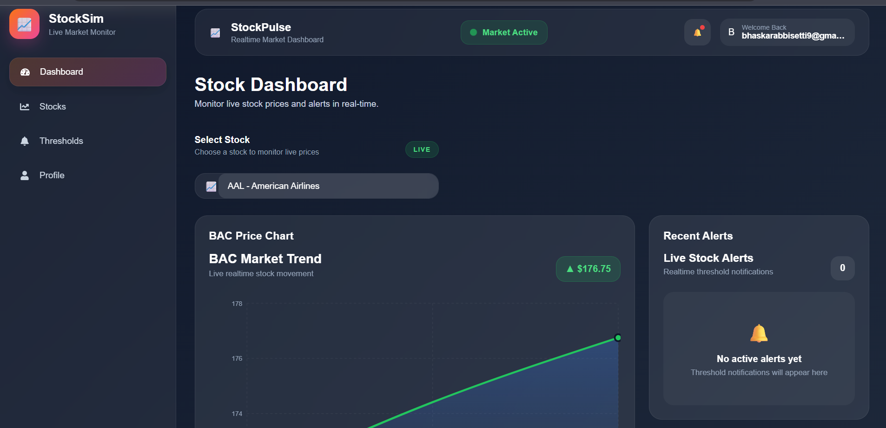
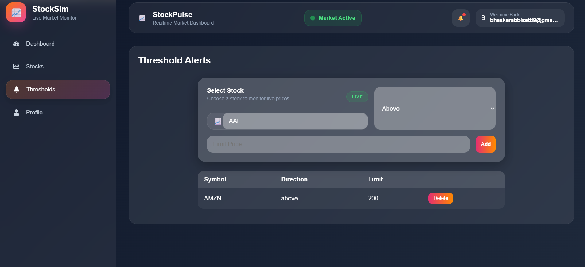
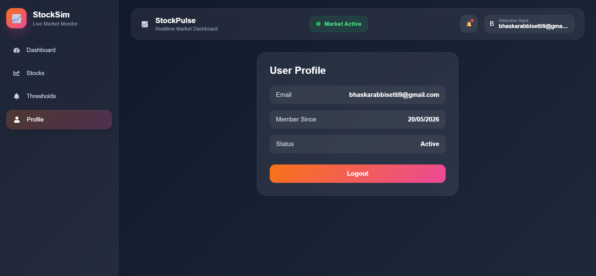

# Real-Time Stock Monitoring Frontend

Frontend application for a real-time stock monitoring and alert system built using React.js and WebSockets.

The frontend displays live stock price updates, allows users to configure stock thresholds, and receives real-time threshold alerts instantly.

---

# Features

- Real-time stock price dashboard
- WebSocket-powered live updates
- Threshold configuration UI
- User authentication
- Responsive UI
- Real-time threshold alerts
- Dockerized deployment

---

# Tech Stack

- React.js
- Socket.IO Client
- Axios
- CSS
- Docker
- Nginx

---

# Installation

## Clone Repository

```bash
git clone https://github.com/BhaskarManikanta/StocksSimulator-frontend.git
cd StocksSimulator-frontend
```

---

# Install Dependencies

```bash
npm install
```

---

# Start Development Server

```bash
npm start
```

---

# Build Application

```bash
npm run build
```

---

# Docker Setup

## Run Container

```bash
docker run -d -p 80:80 bhaskar9999/stock-frontend:latest
```

# Screenshots

## Dashboard Page



---

## Threshold Page



---

## Profile Page



---

# Deployment

The frontend is containerized using Docker and deployed on AWS EC2 using Nginx.

---

# Future Improvements

- Advanced stock charts
- Notification center

---
Backend repo: [https://github.com/BhaskarManikanta/StocksSimulator]
---

# Author

## Abbisetti Bhaskar Manikanta
